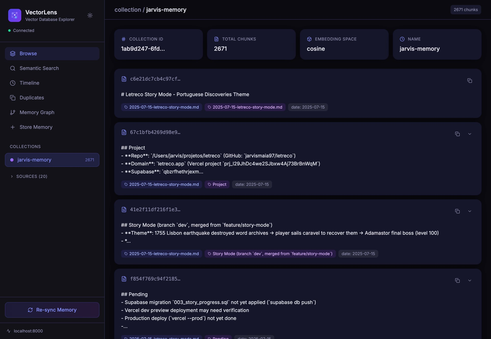
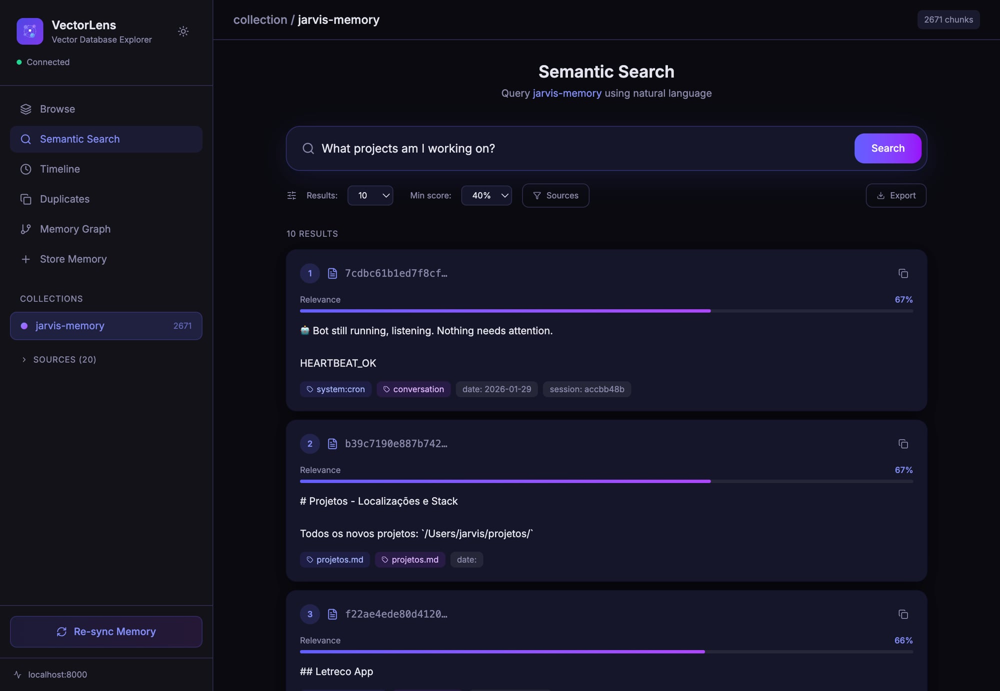
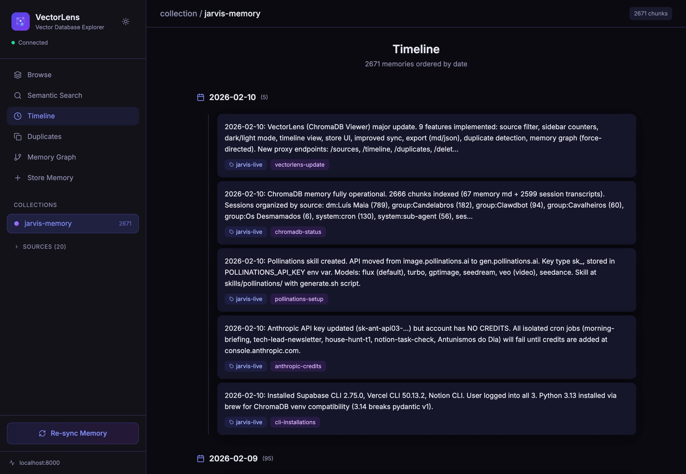
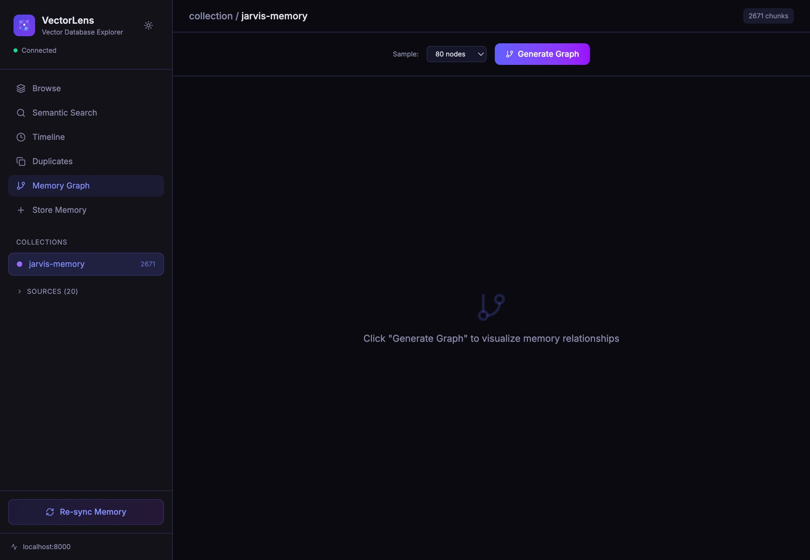

<div align="center">

# 🔍 VectorLens

### The missing UI for ChromaDB

Browse, search, and visualize your vector collections — no code required.



[](LICENSE)
[](docker-compose.yml)
[](https://vectorlens.vercel.app)

</div>

---

## ✨ Features

- **📂 Browse Collections** — View all ChromaDB collections, documents, metadata, and embeddings at a glance
- **🔎 Semantic Search** — Query your collections with natural language and see similarity scores in real time
- **📅 Timeline View** — Visualize when documents were added, with temporal filtering
- **🕸️ Memory Graph** — Interactive force-directed graph showing relationships between documents
- **🔁 Duplicate Detection** — Find near-duplicate entries across your collections

| Browse | Search |
|--------|--------|
|  |  |

| Timeline | Memory Graph |
|----------|--------------|
|  |  |

## 🚀 Quick Start

### Docker (recommended)

```bash
# Clone the repo
git clone https://github.com/jarvismaia97/vectorlens.git
cd vectorlens

# Start VectorLens + ChromaDB
docker compose up -d

# Open http://localhost:8080
```

### Standalone (dev)

```bash
# Prerequisites: Node.js 20+, a running ChromaDB instance
git clone https://github.com/jarvismaia97/vectorlens.git
cd vectorlens
npm install
npm run dev

# Open http://localhost:5173
```

> **Note:** VectorLens connects to ChromaDB via a Python proxy (`query-proxy.py`). Start it with:
> ```bash
> python query-proxy.py
> ```

## 🛠️ Tech Stack

| Layer | Tech |
|-------|------|
| Frontend | React 19, TypeScript, Tailwind CSS 4 |
| Bundler | Vite 7 |
| Graphs | react-force-graph-2d |
| Icons | Lucide React |
| Backend proxy | Python (FastAPI) |
| Database | ChromaDB |
| Deploy | Docker + Nginx |

## 📁 Project Structure

```
vectorlens/
├── src/              # React app source
│   ├── components/   # UI components
│   └── ...
├── landing/          # Static landing page
├── query-proxy.py    # Python proxy for ChromaDB queries
├── Dockerfile        # Multi-stage build
├── docker-compose.yml
└── vite.config.ts
```

## 📄 License

[MIT](LICENSE) © Jarvis Maia
